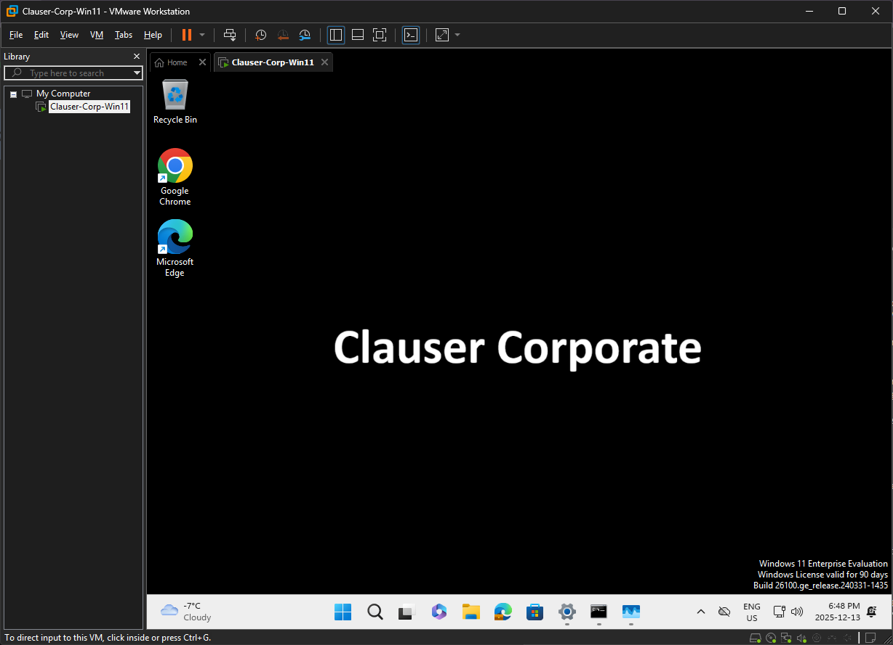

# Zero-Touch Windows Deployment Implementation

## Project Overview

This project demonstrates enterprise device provisioning for Windows 11 endpoints using Microsoft Intune and Entra ID. 

**The Goal**: take a fresh device from power-on to fully configured, secured, and compliant without manual IT intervention.

**Tech Stack:** Microsoft Intune • Microsoft Entra ID • Windows 11 Enterprise • PowerShell 

---

## What This Demonstrates

- **Identity-driven device management** - Entra ID join triggers automatic MDM enrollment and policy application
- **Real-world troubleshooting** - Diagnosed and resolved silent enrollment failures using `dsregcmd /status`
- **Application lifecycle management** - Win32 app packaging with silent deployment and uninstall capability
- **Security automation** - BitLocker encryption, compliance baselines, and automated remediation workflows
- **Operations design** - External asset hosting, tiered escalation models, and self-healing security controls

---

## Implementation Summary

### Phase 1: Identity & Infrastructure 

**Tenant Setup**  
Created Microsoft 365 Business Premium tenant with admin account to enable Intune device management and Entra ID identity services. This was necessary for device management from the cloud.

**Asset Hosting**  
Created GitHub repository to host corporate branding assets (`wallpaper.png`) via stable public URL, allowing Intune policies to reference external resources without embedding dependencies.

**Device Configuration**  
Built Windows 11 Enterprise VM (VMware Workstation Pro, 8GB RAM) with vTPM enabled to support BitLocker compliance requirements.

### Phase 2: Enrollment & Troubleshooting

**Initial Enrollment**  
Device joined Entra ID successfully but policies failed to apply. To troubleshoot this, I used `dsregcmd /status` to identify root cause: `AzureAdJoined: YES` was configured correctly. However, the report showed MDM was not connected. 

**Resolution**  
Enabled **MDM User Scope** setting in Entra ID and set it to All Users. I then refreshed device enrollment using `deviceenroller.exe /c /AutoEnrollMDM`, and confirmed successful connection. 

**Configuration Policy**  
Created Device Restriction profile to enforce corporate wallpaper via URL reference, confirming that Personalization applied correctly on Enterprise SKU.

> **Key Point:** Entra ID join and Intune enrollment are separate processes. Silent failures require OS-level diagnostics, not just portal validation.

### Phase 3: Application Packaging & Deployment

**Win32 App Preparation**  
Downloaded Google Chrome Enterprise MSI and wrapped using Microsoft Win32 Content Prep Tool (`IntuneWinAppUtil.exe`) to create `.intunewin` package.

**Deployment Configuration**  
- **Install command:** `msiexec /i "googlechromestandaloneenterprise64.msi" /qn`
- **Uninstall command:** `msiexec /x {GUID} /qn`
- **Assignment:** Required install for all corporate users
- **Detection:** MSI product code (auto-populated)

Google Chrome deployed silently post-enrollment with zero user interaction. Most MSI-based enterprise apps can be packaged and deployed this way with group-based targeting.

### Phase 4: Security Hardening & Compliance

**BitLocker Encryption Policy**  
Configured Endpoint Security policy requiring:
- **Encryption method:** XTS-AES 256-bit (stronger than default 128-bit)
- **Silent encryption:** TPM-based with all user prompts disabled ensuring clean OOBE
- **Recovery key backup:** Automatic backup of recovery keys to Entra ID

**Compliance Baseline**  
Created Windows compliance policy requiring:
- BitLocker encryption enabled
- Windows Firewall active
- Microsoft Defender Antimalware running
- TPM 2.0 present and functional

**Automated Non-Compliance Actions**  
Designed tiered escalation model:
1. **Immediate:** Mark device non-compliant
2. **Day 1:** Email notification to end user
3. **Day 14:** Escalation email to management
4. **Day 30:** Automatic device retirement

I assigned compliance to user groups rather than devices so security requirements automatically apply regardless of which computer they use.

### Phase 5: Self-Healing Security (In Progress)

**PowerShell Remediation Script**  
Developing detection and remediation logic to monitor BitLocker status and automatically re-enable if disabled by local admin or system glitch.

**Purpose:** Intune policies check device status on a schedule, leaving gaps where BitLocker could remain disabled. This PowerShell script runs locally on the device to detect and re-enable BitLocker immediately, without waiting for the next policy sync or requiring user or IT intervention. Deployed via Intune and runs silently in the background.

---

## Architecture Decisions

**Why Win32 packaging?**  
I chose Win32 packaging because it is more reliable than standard LOB deployments. It gives me full control over install and uninstall commands and lets me write custom detection rules to ensure the app is actually installed correctly.

**Why XTS-AES 256-bit encryption?**  
256-bit is stronger than the default 128-bit and represents current best practices for encryption. I wanted to demonstrate I could configure BitLocker to a higher security standard, and verify it actually worked.

**Why external asset hosting?**  
GitHub is a reliable host, and I wanted to test that Intune could pull and deploy assets from a public URL. Plus this setup avoids file path dependencies that would break if you moved files around locally.

---

## What This Looks Like

**Successful Deployment**  

*Device after first sign-in. Wallpaper and Chrome installed automatically with zero user interaction*

**Compliance Escalation Timeline**  

*Basic automated enforcement: immediate flag → user email → retirement after 30 days*

---

## Project Status

**Completed:**
- Microsoft 365 Business Premium tenant setup
- Device enrollment and validation (troubleshooting documented)
- Win32 app packaging and silent deployment
- BitLocker encryption with silent OOBE
- Compliance policies with automated escalation and email notifications
- Documentation with screenshots and configuration evidence

**In Progress:**
- PowerShell script for ensuring BitLocker remains enabled

---

## Tools & Technologies

| Category | Technology |
|----------|-----------|
| MDM Platform | Microsoft Intune (Plan 1) |
| Identity Provider | Microsoft Entra ID |
| Client OS | Windows 11 Enterprise (25H2) |
| Virtualization | VMware Workstation Pro |
| Scripting | PowerShell 5.1+ |
| Packaging | Microsoft Win32 Content Prep Tool |
| Asset Hosting | GitHub (public repository) |
| Security | BitLocker (AES 256), TPM 2.0 |
| Diagnostics | dsregcmd, deviceenroller.exe |

---

## Key Takeaways

**Admin portals don't always tell the full story.** Device showed as "joined" in Entra ID, but `dsregcmd /status` revealed it wasn't enrolled in Intune MDM. Diagnosing at the OS level caught what the admin portal missed.

**Windows version affects what policies work.** Some configuration settings only apply to Enterprise edition. Tested on the right edition from the start to avoid chasing false issues.

**Initial configuration isn't enough.** Devices can drift over time, and settings can change. Continuous monitoring and automated remediation keep devices secure.

---

## What's Next

This project demonstrates the foundational workflow for Azure-native device management. Natural extensions include:

- Infrastructure as Code (IaC) using Terraform for policy provisioning and tenant replication
- Python automation using Microsoft Graph API for compliance monitoring and reporting
- Azure Monitor and Log Analytics for device telemetry 
- Role-based access control (RBAC) for scoped administrative permissions  
- Conditional app deployment based on user role (developer tools, admin utilities, etc.)
- Windows Autopilot deployment profiles for full out-of-box automation
- Conditional Access policies for Zero Trust security model

**Note:** I came into this project with heavy SCCM experience, and some Intune experience from a prior role. I still made a critical enrollment mistake during setup. The troubleshooting process (using `dsregcmd /status` to identify missing MDM URLs) proved more instructive than getting it right the first time.

---
