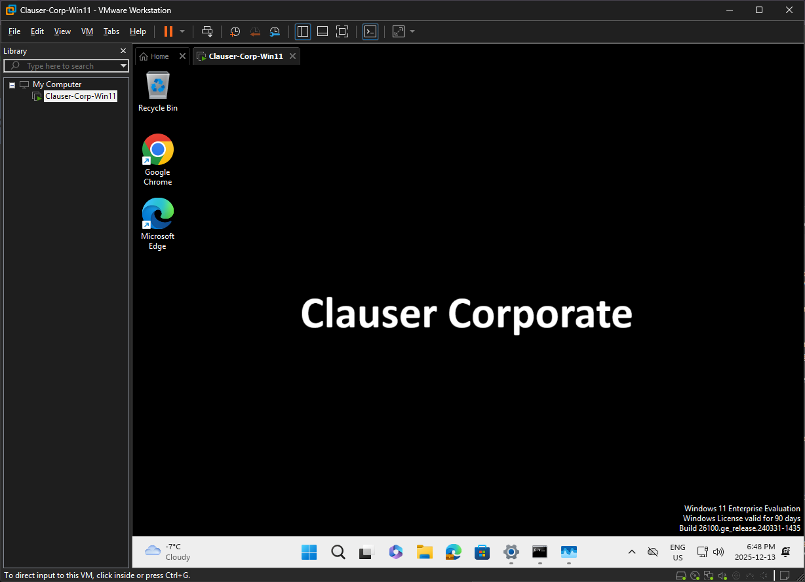
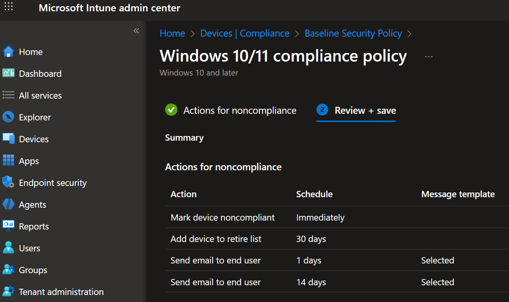

# Zero-Touch Windows Deployment Implementation

Take a fresh Windows 11 device from power-on to fully configured, secured, and compliant with no manual IT intervention. This is a personal project: enterprise device provisioning for Windows 11 endpoints using Microsoft Intune and Entra ID.

Tech stack: Microsoft Intune, Microsoft Entra ID, Windows 11 Enterprise, PowerShell.

## What it does

A device is joined to Entra ID, which triggers automatic MDM enrollment and policy application. From there Intune handles the rest:

- Identity-driven management. Entra ID join kicks off enrollment and policy without a tech touching the machine.
- App lifecycle. Win32 app packaging with silent install and uninstall.
- Security. BitLocker encryption, a compliance baseline, and automated remediation that fixes drift on its own.
- Operations. External asset hosting, a tiered escalation model, and self-healing security controls.

## How I built it

### Phase 1: Identity and infrastructure

Tenant setup. Created a Microsoft 365 Business Premium tenant with an admin account so I could manage devices from the cloud through Intune and run Entra ID identity services.

Asset hosting. Created a GitHub repo to host corporate branding (`wallpaper.png`) at a stable public URL, so Intune policies reference an external resource instead of embedding the file.

Device. Built a Windows 11 Enterprise VM (VMware Workstation Pro, 8GB RAM) with vTPM enabled to meet BitLocker compliance requirements.

### Phase 2: Enrollment and troubleshooting

The device joined Entra ID fine, but policies never applied. I ran `dsregcmd /status` to find the cause. `AzureAdJoined: YES` was correct, but the report showed MDM was not connected. Entra ID join and Intune enrollment are two separate processes, and a silent failure like this needs OS-level diagnostics, not just a green checkmark in the portal.

Fix: enabled the MDM User Scope setting in Entra ID and set it to All Users, then refreshed enrollment with `deviceenroller.exe /c /AutoEnrollMDM` and confirmed the connection.

Then I created a Device Restriction profile to enforce the corporate wallpaper via the URL reference, and confirmed Personalization applied correctly on the Enterprise SKU.

### Phase 3: App packaging and deployment

Downloaded the Google Chrome Enterprise MSI and wrapped it with the Microsoft Win32 Content Prep Tool (`IntuneWinAppUtil.exe`) into an `.intunewin` package.

- Install command: `msiexec /i "googlechromestandaloneenterprise64.msi" /qn`
- Uninstall command: `msiexec /x {GUID} /qn`
- Assignment: required install for all corporate users
- Detection: MSI product code (auto-populated)

Chrome deployed silently after enrollment with zero user interaction. Most MSI-based enterprise apps can be packaged and targeted by group the same way.

### Phase 4: Security hardening and compliance

BitLocker encryption policy (Endpoint Security):
- Encryption method: XTS-AES 256-bit (stronger than the default 128-bit)
- Silent encryption: TPM-based with all user prompts disabled, for a clean OOBE
- Recovery key backup: automatic backup of recovery keys to Entra ID

Compliance baseline (Windows compliance policy) requires:
- BitLocker encryption enabled
- Windows Firewall active
- Microsoft Defender Antimalware running
- TPM 2.0 present and functional

Non-compliance actions, tiered:
1. Immediate: mark device non-compliant
2. Day 1: email the end user
3. Day 14: escalation email to management
4. Day 30: automatic device retirement

I assigned compliance to user groups rather than devices, so the security requirements follow the user regardless of which machine they sign in to.

### Phase 5: Self-healing security

Intune policies only check device status on a schedule, which leaves gaps where BitLocker could sit disabled. So I wrote a PowerShell detection-and-remediation script that runs locally on the device, watches BitLocker status, and re-enables it immediately if a local admin or a glitch turns it off. It runs silently in the background, deployed through Intune, with no wait for the next policy sync and no user or IT intervention.

## Why I made these choices

Win32 packaging over standard LOB. It is more reliable and gives me full control over install and uninstall commands, plus custom detection rules so I know the app actually installed correctly.

XTS-AES 256-bit over the default 128-bit. It is the current best practice, and I wanted to prove I could configure BitLocker to a higher standard and verify it worked.

External asset hosting. GitHub is a reliable host, I wanted to confirm Intune could pull and deploy from a public URL, and it avoids local file-path dependencies that break the moment files move.

## What it looks like

*Device after first sign-in. Wallpaper and Chrome installed automatically with zero user interaction.*

*Basic automated enforcement: immediate flag, user email, retirement after 30 days.*

## Status

Complete:
- Microsoft 365 Business Premium tenant setup
- Device enrollment and validation (troubleshooting documented)
- Win32 app packaging and silent deployment
- BitLocker encryption with silent OOBE
- Compliance policies with automated escalation and email notifications
- Documentation with screenshots and configuration evidence
- PowerShell remediation script that keeps BitLocker enabled

## Tools and technologies

| Category | Technology |
|----------|-----------|
| MDM Platform | Microsoft Intune (Plan 1) |
| Identity Provider | Microsoft Entra ID |
| Client OS | Windows 11 Enterprise (25H2) |
| Virtualization | VMware Workstation Pro |
| Scripting | PowerShell 5.1+ |
| Packaging | Microsoft Win32 Content Prep Tool |
| Asset Hosting | GitHub (public repository) |
| Security | BitLocker (AES 256), TPM 2.0 |
| Diagnostics | dsregcmd, deviceenroller.exe |

## What I learned

Admin portals don't tell the full story. The device showed as joined in Entra ID, but `dsregcmd /status` showed it was never enrolled in Intune MDM. Diagnosing at the OS level caught what the portal missed.

Windows edition decides what policies work. Some configuration settings only apply to Enterprise. I tested on the right edition from the start so I wasn't chasing false issues.

Initial config isn't enough. Devices drift and settings change. Continuous monitoring and automated remediation are what keep them secure.

Don't trust everything on the screen. My PowerShell script displayed "Off" for BitLocker status, so I wrote my code to look for the word "Off." Mistake. It failed silently because the value was actually the number 0, not a string. My instinct as someone who learned to code in Java almost sent me down a rabbit hole.

## Where it could go

This project is done and covers the foundational workflow for Azure-native device management. Natural next steps:

- Infrastructure as Code with Terraform for policy provisioning and tenant replication
- Python automation against the Microsoft Graph API for compliance monitoring and reporting
- Azure Monitor and Log Analytics for device telemetry
- Role-based access control (RBAC) for scoped admin permissions
- Conditional app deployment based on user role (developer tools, admin utilities, and so on)
- Windows Autopilot deployment profiles for full out-of-box automation
- Conditional Access policies for a Zero Trust model

One honest note: I came into this with heavy SCCM experience and some Intune experience from a prior role, and I still made a critical enrollment mistake during setup. Working through it with `dsregcmd /status` to find the missing MDM URLs taught me more than getting it right the first time would have.